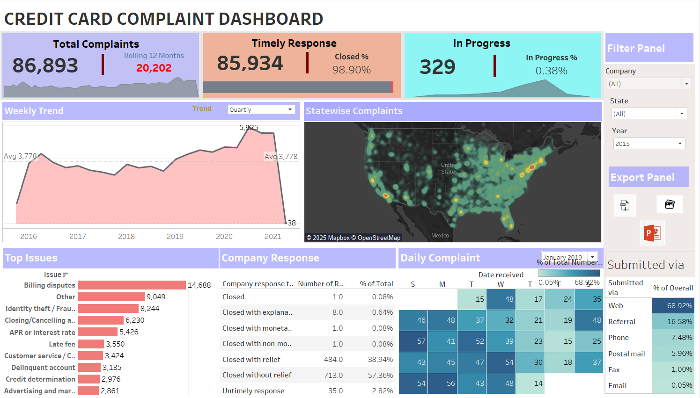

# 💳 Credit Card Complaint Dashboard | Tableau Project

### 📘 Project Overview
This project analyzes **credit card complaint data** received by the **Consumer Financial Protection Bureau (CFPB)** to identify trends in consumer grievances, response efficiency, and issue categories.  
The dashboard provides a **data-driven view** of complaint handling across companies, states, and communication channels — helping regulators and financial institutions improve **customer satisfaction** and **timely resolution performance**.

The analysis and visualization were created in **Tableau Desktop**, with data preparation in **Excel**.

---

### 🎯 Objectives
- Track total credit card complaints across years and states  
- Measure **timely response rate** and **in-progress cases**  
- Identify top complaint issues and their frequencies  
- Evaluate company responses and resolution outcomes  
- Visualize state-level complaint density  
- Analyze consumer submission methods (Web, Phone, Referral, etc.)  
- Provide filters for **Company**, **State**, and **Year** for dynamic exploration

---

### 🧾 Dataset Details
**Source:** Consumer Financial Protection Bureau (CFPB) Open Data Portal  
**Dataset Name:** *Consumer Credit Card Complaints Dataset*  
**File Used:** `Credit Card Dashboard.xlsx`

| Column | Description |
|---------|-------------|
| `Date received` | Date when the complaint was submitted |
| `Product` | Financial product (Credit card, Loan, Mortgage, etc.) |
| `Issue` | Nature of complaint (e.g., Billing dispute, Fraud, APR rate) |
| `Company` | Financial institution involved |
| `State` | Consumer’s state of residence |
| `Submitted via` | Channel through which complaint was received |
| `Company response to consumer` | Final outcome/response from the company |
| `Timely response?` | Whether the company responded on time |
| `Consumer disputed?` | Whether consumer disagreed with company’s resolution |

---

### 💡 Data Preparation Steps
1. **Data Cleaning:**
   - Removed missing or irrelevant entries  
   - Filtered dataset for **Credit Card** related complaints only  
   - Standardized column names and formats  

2. **Feature Engineering:**
   - Added calculated fields:
     - *Rolling 12-Month Complaints*
     - *Timely Response %*
     - *Closed %* and *In-Progress %*  

3. **Data Aggregation:**
   - Grouped data by *year, issue type, state, and company*  
   - Created aggregated metrics for complaint count and resolution status  

4. **Data Visualization Preparation:**
   - Structured cleaned data in Excel → Imported into Tableau  

---

### 📊 Dashboard Components

#### 🔹 KPI Summary
| Metric | Description | Value |
|--------|--------------|-------|
| **Total Complaints** | Total recorded credit card complaints | **86,893** |
| **Rolling 12-Month Complaints** | Complaints received in last 12 months | **20,202** |
| **Timely Response** | Complaints responded to on time | **85,934** |
| **Closed %** | Percentage of cases resolved | **98.9%** |
| **In Progress** | Complaints still open | **329 (0.38%)** |

---

#### 🗓️ Weekly Trend
- Visual line chart showing weekly and quarterly trends from **2016 to 2021**
- Helps identify spikes or drops in complaint activity over time  

---

#### 🗺️ Statewise Complaints
- **Heatmap visualization** showing concentration of complaints across U.S. states  
- Highest complaint densities in **California, Florida, Texas, and New York**

---

#### 📋 Top Issues
- Bar chart highlighting the **most frequent complaint categories**, including:  
  - Billing disputes (14,688 cases)  
  - Fraud / Identity theft (8,244 cases)  
  - Closing/Cancelling accounts (6,230 cases)  
  - APR or Interest rate concerns (5,426 cases)  

---

#### 🏢 Company Response Breakdown
- Displays **response types** and their proportions:  
  - Closed with relief – 38.9%  
  - Closed without relief – 57.3%  
  - Untimely response – 2.8%  
- Allows comparison of customer service effectiveness across companies.

---

#### 📆 Daily Complaint Heatmap
- Calendar-style heatmap visualizing complaint counts by weekday  
- Reveals higher submission rates on **Tuesdays and Wednesdays**

---

#### 🌐 Submitted Via (Channel Analysis)
- Demonstrates how complaints were submitted:  
  | Channel | % of Total |
  |----------|------------|
  | Web | 68.92% |
  | Referral | 16.58% |
  | Phone | 7.49% |
  | Postal Mail | 5.96% |
  | Fax | 1.00% |
  | Email | 0.05% |

- Insight: Most customers submit via **online web forms**, reflecting the growing digital adoption trend.

---

### 🧰 Tools & Technologies
- **Tableau Desktop** – Dashboard creation and interactivity  
- **Microsoft Excel** – Data cleaning and preparation  
- **GitHub** – Version control and project documentation  
- **PowerPoint/PDF** – For presentation and reporting  

---

### 📁 Files in Repository
| File | Description |
|------|--------------|
| `Credit Card Dashboard.xlsx` | Clean dataset used in the analysis |
| `Credit_Card_Complaint_Dashboard.twbx` | Tableau packaged workbook |
| `Credit_Card_Complaint_Dashboard.png` | Dashboard screenshot |
| `README.md` | Project documentation |

---

### 🌐 Dashboard Preview

---

### 🚀 Key Insights
- **Billing disputes** and **fraudulent transactions** account for over **25%** of all complaints.  
- More than **98% of complaints** were **resolved successfully**, showing strong service response.  
- **Timely response rate (99%)** indicates effective consumer protection mechanisms.  
- **Digital channels (Web + Referral)** dominate complaint submissions, proving the importance of digital accessibility.  
- States with higher populations (CA, FL, TX, NY) show proportionally higher complaint volumes.

---

### 📈 Conclusion
This dashboard provides a **comprehensive overview of credit card complaint trends** in the United States.  
It enables banks, regulators, and analysts to:
- Identify operational pain points  
- Evaluate customer experience  
- Ensure timely complaint resolution  
- Strengthen transparency and compliance  

By integrating **data-driven KPIs** with **geographical and categorical insights**, this visualization improves decision-making and promotes better consumer protection standards.

---

### 👨‍💻 Author
**Jaykumar Patel**  
📍 *Master of Applied Computing, University of Windsor*  
🔗  [GitHub](https://github.com/Jay03112000)

---

### 🌐 Tableau Public Link
👉 **[View Interactive Dashboard on Tableau Public](https://public.tableau.com/shared/WTW6PSRGH?:display_count=n&:origin=viz_share_link)**  

